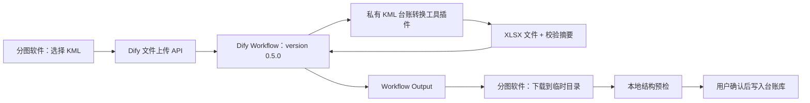

# 需求澄清说明：KML 经纬度台账 Dify 工作流 PRD

> 文档状态：需求初稿，待关键决策确认  
> PRD 版本：0.1  
> 编写日期：2026-08-17  
> 工作流交付格式：Dify DSL YAML，顶层 `version: 0.5.0`  
> 关联产品：御3T分图工具  
> 权威源码范围：项目根目录，不包含 `repo_tmp/gui_classifier/` 历史副本

## 一、用户原始诉求

将当前已经验证可用的“KML 文件转换为线路经纬度台账”过程沉淀为 Dify Workflow。用户只需输入一个 KML 文件，工作流即可返回可被御3T分图工具直接使用的 `.xlsx` 经纬度台账。

随后在御3T分图工具中配置 Dify 服务地址和工作流 API Key，为一线用户提供“上传 KML—自动生成台账—保存到台账库”的自助能力，减少人工转换、复制和改表。

本需求当前只做需求与产品设计，不在本轮直接编写 Dify DSL、转换插件或桌面端代码。

## 二、业务场景

### 2.1 现状

1. 用户取得一条线路的 KML 文件。
2. 通过现有一次性转换过程解析 KML 中的杆塔点。
3. 生成包含“线路名称、杆塔编号、经度、纬度”的 Excel 台账。
4. 用户将台账放入本地台账库，再在分图软件中选择线路并开始分图。

现有过程已经证明业务结果可行，但尚未形成可复用、可部署、可被软件调用的服务，普通用户仍依赖人工协助。

### 2.2 目标价值

- 把一次性人工转换变成稳定的自助服务。
- 保持输出文件与现有分图软件的数据契约一致。
- 对坏 KML、缺失塔号、重复塔号和异常坐标提供可理解的错误信息。
- 让转换过程可追踪、可测试、可升级，不依赖大模型生成结果。
- 避免在软件中硬编码或明文保存公共工作流密钥。

### 2.3 产品原则

- **确定性优先**：KML 解析、校验、排序和 Excel 生成均使用规则代码，不使用 LLM 推断，不产生模型 Token 成本。
- **先校验后落盘**：生成文件必须通过结构校验，才允许写入正式台账库。
- **不静默修正关键数据**：塔号重复、坐标非法等可能影响分图结果的问题必须明确报错或要求人工确认。
- **兼容现有软件**：输出文件名、工作表名、列名和数据类型必须满足当前分类模块。

## 三、使用角色

### 3.1 一线作业人员

- 在分图软件中选择本地 KML。
- 发起台账生成，查看进度和结果。
- 将生成文件保存到选定台账库后继续分图。
- 不接触 Dify API Key 的创建、轮换和平台配置。

### 3.2 软件管理员

- 配置 Dify API Base URL、工作流 API Key、超时和可选代理设置。
- 测试连接、更新或撤销密钥。
- 管理台账库写入位置和同名文件冲突策略。

### 3.3 Dify 工作流管理员

- 导入、测试和发布 `version: 0.5.0` 的工作流 DSL。
- 安装并维护 KML 台账转换工具插件，或配置外部转换服务。
- 查看工作流运行日志，处理限流、配额、存储和版本兼容问题。

### 3.4 开发维护人员

- 维护转换规则、桌面端 API 客户端、测试样例和接口契约。
- 确保 Dify 工作流、转换组件和分图软件升级后仍能互相兼容。

## 四、当前流程

### 4.1 当前转换基线

当前已验证实现的核心行为如下：

1. 读取 KML 文本，并兼容 UTF-8 与带 BOM 的 UTF-16LE。
2. 遍历 KML 中的 `Placemark`。
3. 从 `description` 或 `name` 中提取数字塔号；无法提取时按原始顺序生成顺序号。
4. 从 `coordinates` 读取经度、纬度，校验经度在 `[-180, 180]`、纬度在 `[-90, 90]`。
5. 按数字塔号升序排列。
6. 以 KML 文件名（不含扩展名）作为线路名称。
7. 生成工作表 `经纬度台账`，列为：

| 线路名称 | 杆塔编号 | 经度 | 纬度 |
|---|---|---|---|

### 4.2 当前问题

- 转换脚本中存在固定输入、输出路径，不能直接服务化。
- “缺少塔号时自动生成顺序号”的结果没有向用户提示。
- 对 Point、LineString、Polygon 等 KML 几何对象尚未形成明确业务边界。
- 尚无稳定的 API 请求、文件返回、密钥保存和错误码契约。
- 现有生成文件由人工放入台账库，没有与分图软件的预检和冲突处理闭环。

## 五、目标流程

### 5.1 用户目标流程

1. 管理员首次在分图软件中配置 Dify 服务，并执行“测试连接”。
2. 用户点击“从 KML 获取台账”。
3. 用户选择一个 `.kml` 文件。
4. 软件执行本地前置检查：扩展名、大小、文件可读性和文件名是否合法。
5. 软件上传 KML，并调用已发布的 Dify Workflow。
6. 工作流调用确定性的 KML 台账转换组件，解析、校验并生成 `.xlsx`。
7. Dify 返回生成文件和结构化摘要。
8. 软件下载到临时文件，执行本地台账结构校验。
9. 校验通过后，用户选择保存位置；若正式台账库存在同名文件，软件要求用户确认覆盖、另存为或取消。
10. 保存成功后，软件刷新线路列表，并可自动选中新生成线路。

### 5.2 推荐技术流程



### 5.3 推荐架构决策

**推荐方案：Dify Workflow + 私有工具插件。**

- Workflow 负责文件输入、流程编排、标准输出和运行日志。
- 私有插件负责读取 KML 二进制、XML 安全解析、业务校验和 XLSX 二进制生成，并以文件类型输出。
- 工作流不配置 LLM 节点。
- DSL 文件只负责编排；插件作为独立 `.difypkg` 或私有插件项目交付。

不建议只用 Dify Code 节点完成全部转换。Dify Code 节点运行于隔离沙箱，文件系统、外部网络和系统命令受限；即使能解析传入文本，也难以稳定构造可下载的 XLSX 文件对象。若目标 Dify 环境不允许安装私有插件，可采用备选方案：Workflow 的 HTTP Request 节点调用组织内部的 KML 转换服务，由该服务返回 XLSX 文件。

> `version: 0.5.0` 指 Dify DSL 文件格式版本，不等同于 Dify 服务端版本或插件 SDK 版本。目标环境的 Dify 版本、Cloud/自托管形态和插件安装权限必须在开发前确认。

### 5.4 Dify 工作流节点初判

| 顺序 | 节点 | 作用 |
|---|---|---|
| 1 | User Input / Start | 接收必填的单个 `kml_file`。 |
| 2 | KML 台账转换工具 | 解析、校验、排序并生成 XLSX。 |
| 3 | 业务结果判断 | 区分成功、输入错误和系统错误；具体节点形态以 DSL 0.5.0 兼容性为准。 |
| 4 | Output / End | 返回文件、线路名、塔数、警告、错误码和摘要。 |

## 六、输入内容

### 6.1 工作流业务输入

首期只要求一个输入：

| 变量名 | 类型 | 必填 | 规则 |
|---|---|---|---|
| `kml_file` | 单文件 | 是 | 仅允许 `.kml`；API 传输时优先声明为 `custom` 文件类型，并在目标 Dify 环境验证。 |

线路名称默认从 KML 原始文件名去除扩展名后获得。例如：`500kV玉砚甲线.kml` 输出线路名称 `500kV玉砚甲线`。

首期不增加“线路名称”文本输入，避免文件名和用户输入产生两个权威来源。若文件名不符合正式线路名称，用户应先在本地重命名 KML。后续可增加显式覆盖字段。

### 6.2 KML 内容要求

- KML 必须是可解析的 XML 文档。
- 至少包含一个可识别的杆塔 `Placemark` 点。
- 杆塔对象应包含 `Point/coordinates`。
- 坐标顺序按 KML 标准读取为“经度,纬度,可选高程”。
- 杆塔编号应能从 `description` 或 `name` 的已支持模式中提取为正整数。
- 支持 UTF-8、UTF-8 BOM 和 UTF-16LE BOM；其他编码需在目标样例中验证。
- `.kmz`、网络链接 KML 和需要访问外部资源的 KML 首期不支持。

### 6.3 桌面端配置输入

| 配置项 | 必填 | 说明 |
|---|---|---|
| Dify API Base URL | 是 | 例如组织自托管服务的 `/v1` API 根地址。 |
| Workflow API Key | 是 | 仅管理员配置，不得硬编码到源码或安装包。 |
| API 超时 | 否 | 使用产品默认值，可由管理员调整。 |
| 固定用户标识 | 是 | 上传和运行工作流必须使用同一 `user`；建议由设备 ID 或安装实例 ID 派生，不包含人员敏感信息。 |
| TLS 校验 | 是 | 默认启用，不允许普通用户关闭。 |

## 七、输出内容

### 7.1 Excel 台账文件

输出文件名：

```text
{KML文件名去扩展名}经纬度台账.xlsx
```

输出工作簿必须满足：

- 文件格式为合法的 `.xlsx`，不包含宏。
- 工作表名称固定为 `经纬度台账`。
- 第一行列名及顺序固定为：`线路名称`、`杆塔编号`、`经度`、`纬度`。
- 每个有效杆塔占一行。
- 线路名称在每行重复填写。
- 杆塔编号按正整数升序排列，并以文本或 Excel 可稳定读取的整数形式保存。
- 经纬度为数值，建议展示为 6 位小数，不通过格式化截断原始有效精度。
- 不增加会影响现有读取逻辑的标题行、合并单元格或空白前置行。

### 7.2 Workflow 输出契约

工作流成功和业务失败均应尽量返回结构化字段：

| 字段 | 类型 | 说明 |
|---|---|---|
| `success` | boolean | 是否生成了可用台账。 |
| `ledger_file` | file / nullable | 成功时返回 XLSX 文件对象。 |
| `file_name` | string | 建议保存的文件名。 |
| `line_name` | string | 从 KML 文件名得到的线路名称。 |
| `tower_count` | integer | 输出杆塔行数。 |
| `warning_count` | integer | 非致命警告数量。 |
| `warnings` | array[string] | 例如使用了顺序号、忽略了非 Point 对象。 |
| `error_code` | string | 失败时的稳定错误码，成功时为空。 |
| `message` | string | 面向用户的中文摘要。 |
| `sha256` | string | 输出文件哈希，用于下载后完整性校验。 |

技术异常导致 Workflow 本身失败时，桌面端同时读取 HTTP 状态码、`data.status` 和 `data.error`，不得只依赖 `message` 文本判断成功。

### 7.3 建议错误码

| 错误码 | 含义 |
|---|---|
| `INVALID_FILE_TYPE` | 不是受支持的 KML 文件。 |
| `FILE_TOO_LARGE` | 超过允许大小。 |
| `KML_DECODE_FAILED` | 无法识别或解码文本。 |
| `KML_XML_INVALID` | XML/KML 结构无效。 |
| `NO_TOWER_POINTS` | 未找到杆塔 Point。 |
| `TOWER_NUMBER_INVALID` | 杆塔编号无法按规则处理。 |
| `TOWER_NUMBER_DUPLICATED` | 存在重复杆塔编号。 |
| `COORDINATE_INVALID` | 坐标缺失、非数值或越界。 |
| `XLSX_BUILD_FAILED` | 生成工作簿失败。 |
| `OUTPUT_FILE_MISSING` | 工作流完成但没有返回文件。 |
| `SERVICE_UNAVAILABLE` | Dify 或转换组件不可用。 |

## 八、核心业务规则

### BR-01 单文件单线路

- 每次只处理一个 KML。
- 一个 KML 只生成一条线路台账。
- KML 中若混入多个线路且无法区分，首期不自动拆分，必须报错或要求人工整理源文件。

### BR-02 线路名称

- 默认取原始 KML 文件名去除最后一个扩展名。
- 去除首尾空格。
- 线路名为空、含 Windows 文件名非法字符或仅为保留设备名时，阻止生成正式文件。
- 首期不自动删改线路名中的业务字符。

### BR-03 杆塔对象识别

- 只把含 `Point/coordinates` 的 `Placemark` 作为杆塔候选。
- `LineString`、`Polygon` 和其他非 Point 对象不得误写为杆塔。
- 被忽略的非 Point 对象计入警告摘要。

### BR-04 杆塔编号提取

建议按以下优先级实现并用真实脱敏样例固化：

1. `description` 中明确的“杆塔编号/塔号/#号”模式。
2. `name` 中明确的“杆塔编号/塔号/#号”模式。
3. 与现有基线兼容的纯数字内容。
4. 无法提取时，按 Point 在 KML 中的原始顺序生成顺序号，并产生逐项警告。

若同一次转换中存在重复杆塔编号，默认整体失败，不静默覆盖或合并。是否继续保留第 4 条“自动顺序号”兼容行为是本需求的关键待确认项。

### BR-05 坐标读取

- 读取 `coordinates` 的第一个坐标元组。
- 第一项为经度，第二项为纬度，高程首期忽略。
- 经度必须在 `[-180, 180]`，纬度必须在 `[-90, 90]`。
- 任一杆塔候选坐标非法时默认整体失败，避免输出缺塔台账。
- 不执行 WGS84、GCJ-02、BD-09 等坐标系转换；KML 坐标按 WGS84 使用。

### BR-06 排序与一致性

- 以杆塔编号数值升序输出。
- 同一输入、同一转换组件版本必须生成业务内容一致的台账。
- 生成结果应与当前已验证转换过程对同一基准 KML 的杆塔数、塔号和坐标逐行一致；规则升级导致差异时必须先业务确认。

### BR-07 文件生成与本地落盘

- Dify 只返回文件，不直接写用户 Windows 台账库。
- 分图软件先下载到独立临时文件，并校验扩展名、ZIP/XLSX 结构、工作表、列名、行数和 SHA-256。
- 校验成功后再移动或复制到用户确认的位置。
- 同名文件存在时默认不静默覆盖；用户选择“覆盖”前保留原文件备份或提供“另存为”。
- 下载或校验失败不得破坏已有台账。

### BR-08 Dify API 调用

桌面端按两阶段调用：

1. `POST /files/upload` 上传 KML，取得 `upload_file_id`。
2. `POST /workflows/run`，将文件变量放入 `inputs.kml_file`，传递 `transfer_method: local_file`、`upload_file_id` 和目标环境验证通过的文件 `type`。

两次请求必须使用相同 `user` 和同一个 Workflow API Key。首期可使用 blocking 响应；若目标环境存在网关超时或大文件耗时问题，改用 streaming/SSE，并在软件中显示阶段进度。

### BR-09 API Key 安全

- API Key 不得写入源码、默认配置、日志、报错截图或 Git 仓库。
- 首期若必须由桌面端直接持有 Key，应使用 Windows Credential Manager 或 DPAPI 保护，界面掩码展示，并提供测试、更新和清除功能。
- 每个组织或受控设备组使用可单独撤销的 Key，不共用不可追踪的长期主密钥。
- 软件分发到非受控终端时，推荐增加组织自有 API 网关/代理，由服务端持有 Dify Key；桌面端只持有短期设备凭证。桌面软件无法从本机合法用户处绝对隐藏长期 API Key。

### BR-10 数据安全

- KML 和生成台账包含线路与杆塔坐标，按敏感生产数据处理。
- Dify 部署位置、文件保留时长、日志可见范围、备份和删除机制必须经数据管理方确认。
- XML 解析必须禁用 DTD、外部实体和外部资源访问，防止 XXE 和服务端请求风险。
- 工作流日志不记录完整 KML 正文、完整坐标清单或 API Key。

### BR-11 DSL 与组件版本

- 工作流 YAML 顶层版本固定为 `0.5.0`。
- DSL 中不得包含真实 API Key、生产域名或真实线路数据。
- DSL 必须能在指定目标 Dify 环境导入、发布和执行。
- 工作流依赖的私有插件 ID、插件版本和最低 Dify 版本写入交付说明。
- 工作流升级不得静默改变 Excel 数据契约。

## 九、异常情况

### 9.1 数据为空

- KML 为 0 字节：本地即阻止上传。
- XML 可解析但没有 Point 杆塔：返回 `NO_TOWER_POINTS`，不生成空台账。
- 生成结果为 0 行：视为失败。

### 9.2 必需字段缺失

- 缺少 `Placemark`、`Point` 或 `coordinates`：按对象类型忽略或整体失败，并明确列出数量。
- 文件名无法形成合法线路名称：阻止生成。
- 塔号缺失：按已确认的“报错”或“顺序号+警告”策略处理。

### 9.3 接口调用失败

- 无网络、DNS 失败、TLS 失败、超时：提示服务不可用，允许重试，不删除本地 KML。
- HTTP 401/403：提示配置或权限错误，不反复自动重试。
- HTTP 429：按服务端建议等待，限制自动重试次数。
- HTTP 5xx：允许有限次数指数退避重试，最终失败后保留诊断编号。
- API Base URL 或 Key 无效：测试连接失败，不能进入正式调用。

### 9.4 下游步骤无结果

- Workflow 显示 succeeded 但 `ledger_file` 为空：按 `OUTPUT_FILE_MISSING` 处理。
- 插件返回成功但文件无法下载：整体失败，不写入台账库。
- 下载到的内容不是合法 XLSX：删除临时坏文件并提示校验失败。
- SHA-256 不一致：拒绝落盘。

### 9.5 用户编辑与系统结果不一致

- 用户下载后手工修改台账属于独立人工版本，系统不自动回写 Dify。
- 再次用同一个 KML 生成时，不覆盖用户修改结果，除非用户明确确认。
- 建议在覆盖前展示原文件和新文件的更新时间、塔数及备份位置。

### 9.6 多任务或多数据源混合

- 首期不支持一次选择多个 KML。
- KML 内明显包含多个线路或重复塔号时，不自动拆分或合并。
- 并行调用时，每次运行使用独立临时目录、运行 ID 和下载文件名，避免相互覆盖。

### 9.7 重复点击或提交

- 请求进行中禁用“生成台账”按钮。
- 对同一次本地操作生成客户端请求 ID，避免 UI 重复提交。
- 网络状态未知时先查询或等待当前请求结果，不立即重复创建多个任务。
- 多次成功生成相同文件时仍按本地同名冲突规则处理。

### 9.8 KML 领域异常

- XML 命名空间、CDATA、HTML 描述、大小写差异和空白需有专项测试。
- `coordinates` 含多组坐标时只允许 Point 语义；非 Point 多坐标不取首点冒充杆塔。
- 数字中夹带线路电压等级时，不得把 `500kV` 的 `500` 误判为塔号。
- 非纯数字或复合塔号当前分图软件不能稳定支持，首期应报错或进入人工处理，不宣称支持。

## 十、边界说明

### 10.1 本次做什么

- 设计并交付可导入的 Dify Workflow DSL，YAML `version: 0.5.0`。
- 提供确定性的 KML 解析和 XLSX 生成组件。
- 输出与分图软件兼容的经纬度台账。
- 在分图软件增加服务配置、测试连接、KML 选择、上传、运行、下载、本地校验和保存入口。
- 建立错误码、日志、重试、密钥保护和同名文件确认机制。
- 使用脱敏样例完成工作流和桌面端端到端验收。

### 10.2 本次不做什么

- 不使用 LLM 识别塔号或修复坐标。
- 不支持 `.kmz`、Shapefile、GeoJSON、GPX 等其他格式。
- 不支持一个文件拆分多条线路或批量上传多个 KML。
- 不生成或自动维护 `1双回塔台账文件.xlsx`。
- 不自动判断双回线路左右侧。
- 不修改现有照片分类算法和输出目录规则。
- 不自动上传照片、现有台账库或其他生产资料。
- 不支持复合塔号，除非后续先扩展分图软件的数据契约。

### 10.3 后续迭代方向

1. 支持 `.kmz` 解包与校验。
2. 支持批量 KML 和多线路拆分预览。
3. 支持用户显式覆盖线路名称。
4. 增加地图预览、塔序连线、重复点和异常跳点检查。
5. 对比现有台账，展示新增、删除和坐标变化后再确认更新。
6. 生成或辅助维护双回塔台账。
7. 增加组织级 API 网关、设备认证、配额和审计。

### 10.4 人工确认与回退边界

- 新台账写入正式台账库前必须通过本地结构预检。
- 覆盖已有台账前必须由用户确认，并保留可恢复备份。
- 工作流或转换规则升级后，先用固定脱敏基准 KML 比对，再发布。
- 云端服务不可用时，分图软件仍允许用户选择已有本地台账完成分图；本功能失败不得阻断原有主流程。
- 如新组件生成结果与已确认基线不一致，停止发布并回退到上一工作流/插件版本。

## 十一、涉及模块初判

| 模块 | 预计改动 | 风险 |
|---|---|---|
| Dify Workflow DSL | 新增 `version: 0.5.0` 工作流、输入和输出契约 | 中 |
| 私有 KML 转换插件 | XML 安全解析、业务校验、XLSX 生成、文件输出 | 高 |
| 备选内部转换服务 | 仅在无法安装插件时需要 | 高 |
| `gui_classifier.py` | 增加“从 KML 获取台账”入口、状态和结果提示 | 中高 |
| 新增 API 客户端模块 | 上传、运行、SSE/阻塞响应、下载、重试和错误映射 | 高 |
| 本地配置模块 | Base URL、加密 Key、固定 user、测试连接 | 高 |
| 本地台账预检 | 校验工作表、列、塔号、坐标和行数 | 中 |
| 台账库写入 | 临时文件、原子保存、同名冲突和备份 | 高 |
| PyInstaller 构建 | 收集新增网络、加密和证书相关依赖 | 中高 |
| 自动化测试 | KML 解析、恶意 XML、API mock、下载和 GUI 状态 | 高 |
| 部署与运维文档 | Dify 版本、插件安装、密钥轮换、日志和数据保留 | 中 |

建议将 Dify API 调用和转换逻辑放在独立模块中，不把网络请求或 KML 解析直接塞进 Tkinter 回调。GUI 只负责收集输入、展示进度和触发后台任务。

## 十二、需要进一步确认的问题

开发前只需优先确认以下关键项：

1. **需确认｜目标 Dify 环境**：使用 Dify Cloud 还是自托管？准确服务端版本是多少？是否允许安装私有 `.difypkg` 插件？
2. **需确认｜缺失塔号策略**：继续兼容当前“按原始顺序自动编号并警告”，还是只要有一个塔号无法识别就整体失败？推荐整体失败或要求用户确认，避免错误塔序直接进入分图。
3. **需确认｜API Key 部署范围**：软件只在受控内网电脑使用，还是会分发到无法统一管理的终端？后者推荐先建设 API 网关，不把长期 Dify Key 直接配置到客户端。
4. **需确认｜KML 规模上限**：最大文件大小和最大杆塔数量需用真实脱敏样例确定。首期建议产品限制为 15 MB、5000 个 Point，并以目标 Dify 部署限制为准。
5. **需确认｜同名台账策略**：推荐“默认另存为/取消，用户明确确认后才覆盖并备份”；需确认是否符合现场习惯。
6. **需确认｜文件保留策略**：Dify 中上传的 KML、生成 XLSX 和运行日志需要保留多久，谁有查看和删除权限？

## 十三、下一步建议

### 13.1 推荐实施顺序

1. **兼容性探针**：在目标 Dify 环境手工建立最小 Workflow，验证 `.kml` 上传类型、私有插件文件输入、XLSX 文件输出及 API 下载方式。
2. **固化转换规则**：用当前已验证 KML 和输出台账建立脱敏基准样例，确认塔号提取与异常策略。
3. **实现转换组件**：优先做私有插件；若权限不具备，再实现内部转换服务。
4. **生成并导入 DSL**：确保 YAML 顶层 `version: 0.5.0`，完成导入、发布、导出回归。
5. **实现桌面端客户端**：先做独立 API 客户端与 mock 测试，再接入 GUI。
6. **端到端验收**：从本地 KML 到正式台账库，全链路验证成功、失败、重试、覆盖和回退。

### 13.2 首期验收标准

- DSL 文件顶层 `version: 0.5.0`，可在指定 Dify 环境无错误导入和发布。
- 不依赖 LLM 节点，正常转换 Token 消耗为 0。
- 合法基准 KML 生成合法 XLSX，工作表和四个列名完全符合约定。
- 生成结果与当前基线台账逐行比对一致，包括线路名、塔号、经度和纬度。
- 0 字节、坏 XML、无 Point、重复塔号、非法坐标、复合塔号均得到稳定错误码，不产生“成功”空文件。
- `LineString`、`Polygon` 不会被误识别为杆塔。
- API 上传和运行使用相同 `user`，Key 不出现在日志、源码或普通配置明文中。
- Workflow succeeded 但无文件、下载中断、内容非 XLSX、哈希不一致时均拒绝写入台账库。
- 同名正式台账未经确认不会被覆盖，覆盖时存在可恢复备份。
- 请求期间重复点击不会产生并发重复任务。
- Dify 不可用或转换失败不影响软件继续选择已有本地台账并执行原有分图流程。
- 源 KML 不被移动、删除或改写。

### 13.3 参考依据

- Dify 官方 API 规定本地文件先通过 `/files/upload` 上传，再以 `upload_file_id` 传入 Workflow；上传与后续调用需使用相同 `user`：[Upload File](https://docs.dify.ai/en/api-reference/files/upload-file)、[Run Workflow](https://docs.dify.ai/en/api-reference/workflow-runs/run-workflow)。
- Workflow 必须发布后才能通过 `/workflows/run` 调用，API Key 使用 `Authorization: Bearer ...`：[Run Workflow](https://docs.dify.ai/en/api-reference/workflow-runs/run-workflow)。
- Workflow Output 支持 `file` 类型输出变量：[Output Node](https://docs.dify.ai/en/cloud/use-dify/nodes/output)。
- Code 节点运行于隔离沙箱，文件系统、外部网络和系统命令受限，因此不作为首期 XLSX 文件生成主方案：[Code Node](https://docs.dify.ai/en/cloud/use-dify/nodes/code)。
- 私有工具插件能够返回文件 BLOB，适合封装确定性的转换能力：[Tool Return](https://docs.dify.ai/en/develop-plugin/features-and-specs/plugin-types/tool)。
